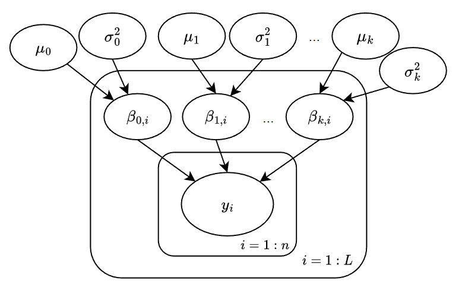

\newpage

```{r, warning=FALSE, results="hide", message=FALSE, echo=FALSE}
library(ggplot2)
library(posterior)
library(bayesplot)
library(rstan)
library(ggpubr)
library(tidyr)
library(dplyr)
library(ggcorrplot)
library(gridExtra)
library(plyr)
library(loo)
library(invgamma)

set.seed(123)
credit_risk <- read.csv(file="german_credit_data.csv")
summary(credit_risk)
credit_risk <- subset(credit_risk, select=-c(`X`))
```

# Introduction

This project is part of the Aalto University Bayesian Data Analysis 2022 Course. 

One of the most important services of banks that attract their customers is providing credits. However, when lenders offer home loans, auto loans, or business loans, there is an inherent risk that borrowers will default on their payments, and this is termed as *credit risk*. Credit risk is universally known as the possibility of a loss for a lender due to a borrower’s failure to repay a loan. When the credit risk is mishandled by the lenders, the consequences can be catastrophic. The collapse of the housing market in 2008 and the ensuing recession were one of the best illustration of how severe the outcome can be: in just a few months, the banking sector nearly collapsed due to a significant overexposure to credit defaults. Therefore, it is essential to determine the borrowers' ability to meet debt obligations as well as the risks involved, and this process is known as credit risk analysis. 

The reason this topic is chosen is because of its meaningfulness and significance to the credit market, and the fact that there has been limited Bayesian data analysis project performed on the topic. Our goal is to use Logistic Regression to identify the riskiness of a loan by classifying them into good and bad loan. A pooled and hierarchical models will be applied to this problem, and through results analysis, we can compare and choose a stronger-performed model for this problem.

The report consists of the following parts: Introduction, Data description, Models, Results, Discussion, Conclusion, and Appendices. First, we formulate the problem and show how we handle the data through pre-processing and feature selection process. In the Models section, we describe the two Stan models used and justify their likelihood and justification of their choice. In the Results section, we perform analyze the performance of the models through convergence analysis, posterior predictive checks, predictive performance assessment, model selection, and prior sensitivity analysis. Finally, in the Discussion and Conclusion section, we will address the issues and potential improvements for our models, as well as some interesting insights that we have learned while doing the project. The Appendices part will include all the Stan models being used in this report. 

# Data description
The data set is obtained through Kaggle. It contains 1000 data points with 20 categorical attributes created by Professor Hofmann. In this data set, each entry represents a person taking a credit by a bank, and each person is classified as good or bad credit risks according to the set of attributes. The full data set can be found [here](https://www.kaggle.com/datasets/kabure/german-credit-data-with-risk).

The data consists of 10 columns, 9 explanatory variables and 1 target variable, defined as follows:

Explanatory variables:

- Age (numerical): The age of the subject.
- Sex (textual/categorical): The gender of the subject. This includes "`male`" and "`female`".
- Job (numerical/categorical): The level of employment of the subject. This includes `0` - unskilled and non-resident, `1` - unskilled and resident, `2` - skilled, `3` - highly skilled.
- Housing (textual/categorical): The type of housing of the subject. This includes "`own`", "`rent`" and "`free`".
- Saving.accounts (textual/categorical): The level of wealth of subject's saving account. This includes "`little`", "`moderate`", "`quite rich`", "`rich``".
- Checking.account (textual/categorical): The level of wealth of subject's checking account. This includes "`little`", "`moderate`", "`quite rich`", "`rich``".
- Credit.amount (numerical): The amount of credit of the subject's loan.
- Duration (numerical): The contracted loan due time (in month).
- Purpose (textual/categorical): The purpose of the subject's loan.

Target variable:

- Risk (textual/categorical): The fact that the subject has defaulted (not repaying the loan). This includes `good` - good loan (the subject has repaid on time), `bad` - bad loan (the subject has defaulted).

The data set have missing data: the columns Saving.accounts and Checking account both contain `NA` values (missing variables), which takes $18.3$% and $39.4$% of the total observations, respectively.
```{r, echo=FALSE, comment=""}
isNA <- function(x){sum(is.na(x))/length(x)*100}
apply(credit_risk, 2, isNA)
```

## Data preprocessing and cleaning
We can explore the data by plotting histograms for the features corresponding with their target values. The histograms can provide insights regarding the correlation between the explanatory variables (features) with the target variables Risk.

```{r, echo=FALSE}
ageplot <- ggplot(credit_risk, aes(x=Age, y=Risk, color=Risk)) +
  labs(y="") +
  geom_point(size=3) + theme(axis.text=element_text(size=16),
        axis.title=element_text(size=20), legend.text=element_text(size=20), legend.title =element_text(size=20) )

sexplot <- ggplot(credit_risk, aes(x=Sex, fill=Risk)) +
  labs(y="") +
  geom_bar()+ theme(axis.text=element_text(size=16),
        axis.title=element_text(size=20))+ guides(fill="none")

jobplot <- ggplot(credit_risk, aes(x=Job, fill=Risk)) + guides(fill="none")+
  labs(y="") +
  geom_bar()+ theme(axis.text=element_text(size=16),
        axis.title=element_text(size=20))

housingplot <- ggplot(credit_risk, aes(x=Housing, fill=Risk))+
  labs(y="") + guides(fill="none") +
  geom_bar()+ theme(axis.text=element_text(size=16),
        axis.title=element_text(size=20))

savingplot <- ggplot(credit_risk, aes(x=Saving.accounts, fill=Risk)) + guides(fill="none")+
  labs(y="") +
  geom_bar()+ theme(axis.text=element_text(size=16),
        axis.title=element_text(size=20))

checking_plot <- ggplot(credit_risk, aes(x=Checking.account, fill=Risk))+ guides(fill="none") +
  labs(y="") +
  geom_bar()+ theme(axis.text=element_text(size=16),
        axis.title=element_text(size=20))

credit_plot <- ggplot(credit_risk, aes(x=Credit.amount, y=Risk, color=Risk)) + guides(fill="none")+
  labs(y="") +
  geom_point(size=3)+ theme(axis.text=element_text(size=16),
        axis.title=element_text(size=20))

duration <- ggplot(credit_risk, aes(x=Duration, y=Risk, color=Risk))+ guides(fill="none") +
  labs(y="") +
  geom_point(size=3)+ theme(axis.text=element_text(size=16),
        axis.title=element_text(size=20))

purpose_plot <- ggplot(credit_risk, aes(x=Purpose, fill=Risk)) +
  labs(y="") +
  geom_bar() + guides(fill="none") + 
  theme(legend.position="top")+ theme(axis.text=element_text(size=16),
        axis.title=element_text(size=20))
```

```{r, echo=FALSE, message=FALSE, warning=FALSE, results='hide', fig.align='center', fig.height=6, fig.width=25}
ggarrange(ageplot, credit_plot, duration, ncol=3, common.legend=TRUE)
ggarrange(housingplot, jobplot, sexplot, ncol=3)
ggarrange(savingplot, checking_plot, ncol=2)
purpose_plot
```
There are some issues that can be observed from the histograms:

- The variables Saving.accounts and Checking.account have `NA` values (which is also suggested at the Data set description section above).
- The continuous variables Credit.amount and Duration have single-point outliers, as their histograms clearly show a significantly larger values clearly separating themselves from the rest of the population.
- The discrete variables Saving.accounts and Purpose have a high scatter level. That is, their histograms show that the data was categorized into too many groups while some groups are relatively low in population.

We have provide some fix to these issues:

- In order to resolve the high `NA` values presented in two of the features, we decided to impute the missing data with the mode (most frequent value) of data, which, from the plots, is the "`little`" value. Mode imputation is an popular method for filling missing data of categorical data, especially when the data is unbalanced and highly skewed towards the most frequent value like Saving.accounts and Checking.accounts. 

- To resolve the outliers presented in the Credit.amount and Duration, because they are very little in population, we can just remove them from the data. For Credit.amount, we remove the maximum data point; for Duration, the outlier is also just a single data point so we just delete the maximum of the column from the data.

- To resolve the high sparse level presented in Saving.accounts and Purpose, a possible solution could be merging the less populated groups with the relevant counterparts. With Saving.accounts, we merge the "`rich`" and "`quite rich`" values into "`rich`"; with Purpose, we merge `domestic appliances` with `funiture/equipment` into "`funiture/equipment`", `repairs` with `vacation/others` into "`others`". This fix will help to data to be less scattered and make the models constructed later to predict more robust results.

One additional, but important, step that could be made to our data is standardization. The input consists of different variables (categorical, numerical, textual) with distinct scales so standardizing them is vital for the models to perform better. In addition, standardizing can facilitate the process of prior choosing for the features, since all variables are on the same scale. To standardize, we transform all variables (including target) to numerical. Then, we scale the explanatory variables them so that their mean $=0$ and standard deviation $=1$. 

```{r, echo=FALSE, message=FALSE, warning=FALSE, results='hide'}
# Impute NA
get_mode <- function(x) {
  ux <- unique(x)
  ux <- na.omit(ux)
  ux[which.max(tabulate(match(x, ux)))]
}

credit_risk$`Saving.accounts`[is.na(credit_risk$`Saving.accounts`)] <- get_mode(credit_risk$`Saving.accounts`)
credit_risk$`Checking.account`[is.na(credit_risk$`Checking.account`)] <- get_mode(credit_risk$`Checking.account`)

miss <- function(x){sum(is.na(x))/length(x)*100}
apply(credit_risk, 2, miss)

# Merge sparse values
credit_risk$Purpose <- plyr::mapvalues(credit_risk$Purpose,
                                       from = c("business","car","domestic appliances",
                                      "education","furniture/equipment","radio/TV","repairs","vacation/others"), 
                                      to = c("business","car","furniture/equipment","education",
                                             "furniture/equipment","radio/TV","others","others")) 
credit_risk$Saving.accounts <- plyr::mapvalues(credit_risk$Saving.accounts, 
                                         from =c("little","moderate","quite rich","rich"), 
                                         to = c("little","moderate","rich","rich"))

# Remove outliers
credit_risk <- credit_risk[credit_risk$Credit.amount < max(credit_risk$Credit.amount),]
credit_risk <- credit_risk[credit_risk$Duration < max(credit_risk$Duration),]


# Suffle data
credit_risk <- credit_risk[sample(nrow(credit_risk)), ]


# Convert data into numerical data
credit_risk$Sex = as.numeric(factor(credit_risk$Sex))
credit_risk$Housing = as.numeric(factor(credit_risk$Housing))
credit_risk$Saving.accounts = as.numeric(factor(credit_risk$Saving.accounts))
credit_risk$Checking.account = as.numeric(factor(credit_risk$Checking.account))
credit_risk$Purpose = as.numeric(factor(credit_risk$Purpose))
credit_risk$Risk = as.numeric(factor(credit_risk$Risk)) - 1

# Standardize data
data_pooled <- credit_risk %>% mutate_at(colnames(credit_risk)[!colnames(credit_risk) %in% c("Risk")], ~(scale(.) %>% as.vector))
data_hierarchical <- credit_risk %>% mutate_at(colnames(credit_risk)[!colnames(credit_risk) %in% c("Risk", "Purpose")], ~(scale(.) %>% as.vector))
```

## Explanatory variables analysis
We can select the final explanatory variables for the models by using a correlation matrix to shows the correlated level of each variables with each other.

```{r, r, echo=FALSE, message=FALSE, warning=FALSE, results='hide', out.width='70%', fig.align='center'}
ggcorrplot(cor(credit_risk), lab = TRUE, lab_size = 3)
```

From the correlation plot, we observe no correlation greater than $0.9$ between the features so no significant multicollinearity is presented. However, it is noticable that the Housing variable shows the lowest correlation with the target variable (only $-0.02$), indicating that it is quite insignificant to the sampling process. This should be noted, as later on, some actions will be taken to to diminish its effect on the results. 

In conclusion, the explanatory variables are chosen for the pooled are Age, Sex, Job, Housing, Saving.accounts, Checking.account, Duration, Purpose, with Housing being the less correlated with the target values. For the hierarchical model, however, Purpose will instead be used as a levels grouping variable and will be excluded from the explanatory variables.

# Models description

## Pooled Logistic Regression model
The Logistic Regression model is used to classify the risk $y$ in lending a loan based on the observation $x$. Its predictor $p$ is parameterized with an intercept $\beta_0$ and explanatory coefficients $\beta_1,\beta_2,..., \beta_k$ as follows:
\[
\begin{aligned}
p &= \frac {e^{\beta_0+\beta_1 x_{n,1}+...+\beta_k x_{n,k}}} {1-e^{\beta_0+\beta_1 x_{n,1}+...+\beta_k x_{n,k}}} \\
&= logit^{-1}(\beta_0+\beta_1 x_{n,1}+...+\beta_k x_{n,k})
\end{aligned}
\]
The target variable $y$ for the observations $x$ follows the distribution:
$$
y_n \sim Bernoulli(p)=Bernoulli(logit^{-1}(\beta_0+\beta_1 x_{n,1}+...+\beta_k x_{n,k}))
$$
where $\beta_0$ is the intercept and each $\beta_1,\beta_2,..., \beta_k$ models the regression coefficient for each feature.

### Prior justification
Because of the standardized data, we may assume a commonly-used generic weakly informative priors for the explanatory coefficients:
$$
\beta_0, \beta_1,...,\beta_k \sim normal(0, 1)
$$
A Normal distribution with location parameter of 0 expresses our little knowledge of whether a change in input variables can affect the predicted target, while a standard deviation of 1 widens the shape of the distribution so that it, softly concentrates below the scale, which is weakly informative enough for our standardized data.

However, as noted, for the potentially irrelevant variable Housing, which corresponds to $\beta_3$, we assume an informative prior:
$$
\beta_3 \sim normal(0, 0.01)
$$
This informative prior serves as an powerful *regularization prior* scaling the insignificant coefficient $\beta_3$ to nearly zero, but not completely disregard them from the model, therefore shrinking its effect on the results. This effect shrinkage idea is to justify model selection, according to [Paul et al. (2014)](#references). 

### Running the model
Before running, the input data was separated into training data and testing data with equal proportions (half) of the data. While the training set is used for the sampling process of the mode, the test set is utilized for predictions and accuracy testing purposes.
```{r, comment=""}
train_size <- round(nrow(data_pooled)/2, 0)
test_size <- nrow(data_pooled) - train_size
cat("Train size:", train_size, "/ Test size:", test_size)
```

The model is then run with 4 chains, 2000 iterations and 1000 warm-ups. 

```{r, message=FALSE, warning=FALSE, results='hide'}
data_train <- head(data_pooled, train_size)
data_test <- tail(data_pooled, test_size)

y_train_pooled = data_train$Risk
y_test_pooled = data_test$Risk

X_train_pooled = subset(data_train, select=-c(`Risk`)) 
X_test_pooled = subset(data_test, select=-c(`Risk`)) 

credit_data_pooled <- list(N_train=nrow(X_train_pooled), 
                            K=ncol(X_train_pooled), 
                            X_train=X_train_pooled, 
                            y_train=y_train_pooled,
                            N_test=nrow(X_test_pooled),
                            X_test=X_test_pooled)

pooled_fit <- stan(file="pooled.stan", data=credit_data_pooled, 
                   chains=4, iter=2000, warmup=1000)
```

## Hierarchical Logistic Regression model
The hierarchical model, though resembles the pooled model in using Logistic Regression, is a relatively more complex model. As mentioned in the Explanatory variables analysis section, the data is categorized into $L$ groups using the categorical data in the Purpose variable. The coefficients $\beta_0, \beta_1,...,\beta_k$ is then sampled separately for each of $L$ groups using their own *hyper-parameters* $\mu$ and $\sigma^2$. The structuring of the model can be given as below:

```{r echo=FALSE, out.width='50%', fig.align='center'}

```

With each of $L$ groups having their own $\beta_0, \beta_1,...,\beta_k$ sampled separately, we can build a Logistic Regression equation for the target variable:
\[
\begin{gathered}
y_n \sim Bernoulli(logit^{-1}(\beta_{0,L(n)}+\beta_{1,L(n)} x_{n,1}+...+\beta_{k,L(n)} x_{n,k})),\\ \text{ with }L(n) \text{ being the group of the }n^{th} \text{ data}\\
\end{gathered}
\]

### Prior justification
We can estimate the coefficients $\beta_{0,L(n)}, \beta_{1,L(n)}, ..., \beta_{k,L(n)}$ using a Normal prior with the hyper-parameters $\mu$ and $\sigma^2$:
$$
\beta_{i,L(n)} \sim \mathcal{N}(\mu_i, \sigma_i^2), \text{ with }i=1:k
$$
For the hyper-parameter $\mu_i$, we assume a the same generic weakly-informative prior:
$$
\mu_i \sim \mathcal{N}(0, 1)
$$
Note that because of the standardization step, this prior is considered to be weakly-informative enough to not creating biases. We have explained the choice of this prior above in the pooled model.

For the hyper-parameter $\sigma^2$, we assume a weakly-informative inverse-gamma prior:
$$
\sigma_i^2 \sim InvGamma(0.5, 1)
$$
In hierarchical modelling, the inverse-gamma distribution is a common prior for hyper variance estimating. The shape of this distribution has a wide and heavy right tail, indicating that it is positive and weakly-informative, which is suitable for our estimation for $\sigma^2$.

For the weakly significant Housing variable, similar to the previous model, we assume informative regularization priors for the hyper parameters:
\[
\begin{gathered}
\mu_3 \sim \mathcal{N}(0, 0.01) \\
\sigma_3 \sim InvGamma(1, 0.01)
\end{gathered}
\]
The priors $\mathcal{N}(0, 0.01)$ and $InvGamma(1, 0.01)$ are strongly informative, they both scales the hyper mean $\sigma_3$ and variance $\sigma_3$ of the Housing variable close to zero. As explained in the previous model, this is to shrink the effect of the potentially irrelevant variable Housing onto the sampling process of the model.

### Running the model
Before running, the input data was separated into training data and testing data with equal proportions (half) of the data. While the training set is used for the sampling process of the mode, the test set is utilized for predictions and accuracy testing purposes.
```{r, comment=""}
train_size <- round(nrow(data_hierarchical)/2, 0)
test_size <- nrow(data_hierarchical) - train_size
cat("Train size:", train_size, "/ Test size:", test_size)
```

The model is then run with 4 chains, 2000 iterations and 1000 warm-ups. 
 
```{r, message=FALSE, echo=FALSE, results='hide'}
data_train <- head(data_hierarchical, train_size)
data_test <- tail(data_hierarchical, test_size)

y_train_hierarchical = data_train$Risk
y_test_hierarchical = data_test$Risk

X_train_hierarchical = subset(data_train, select=-c(`Risk`, `Purpose`)) 
X_test_hierarchical = subset(data_test, select=-c(`Risk`, `Purpose`)) 

ll_train = data_train$Purpose
ll_test = data_test$Purpose

credit_data_hierarchical <- list(N_train=nrow(X_train_hierarchical), 
                                  K=ncol(X_train_hierarchical), 
                                  L_train=length(unique(ll_train)),
                                  ll_train=ll_train,
                                  X_train=X_train_hierarchical, 
                                  y_train=y_train_hierarchical,
                                  N_test=nrow(X_test_hierarchical),
                                  L_test=length(unique(ll_test)),
                                  ll_test=ll_test,
                                  X_test=X_test_hierarchical)

hierarchical_fit <- stan(file="hierarchical.stan", data=credit_data_hierarchical, chains=4, iter=2000, warmup=1000)
```

# Results analysis

## Covergence diagnostics

### $\hat{R}$ diagnostics
The $\hat{R}$ values for the the models are plotted into histograms:

```{r, warning=FALSE, message=FALSE, results='hide', echo=FALSE, out.width='80%', fig.align='center'}
r_hat_pooled = summary(pooled_fit)$summary[,"Rhat"]
r_hat_hierarhical = summary(hierarchical_fit)$summary[,"Rhat"]

rhat_pooled <- mcmc_rhat_hist(r_hat_pooled) + 
  labs(title="Pooled model")  +
  theme(plot.title = element_text(hjust = 0.5))

rhat_hierarchical <- mcmc_rhat_hist(r_hat_hierarhical) + 
  labs(title="Hierarchical model")  +
  theme(plot.title = element_text(hjust = 0.5))

ggarrange(rhat_pooled, rhat_hierarchical, ncol=2, common.legend=TRUE)
```
The histograms clearly shows that all $\hat{R}$ values are smaller than $1.05$, and their distributions are relatively skewed at $1.00$. This suggests that the chains for both models have converged well.

### Effective sample size (ESS) diagnostics
Instead of directly plotting the ESS, we instead plot another metrics called ESS ratio, which simply equals to $N_{\text{eff}}/N_{\text{sample}}$ - the ratios of effective sample size to total sample size. 
```{r, warning=FALSE, message=FALSE, results='hide', echo=FALSE, out.width='80%', fig.align='center'}
ess_pooled <- mcmc_neff_hist(neff_ratio(pooled_fit)) + 
  labs(title="Pooled model")  +
  theme(plot.title = element_text(hjust = 0.5))
ess_hierarchical <- mcmc_neff_hist(neff_ratio(hierarchical_fit)) + 
  labs(title="Hierarchical model")  +
  theme(plot.title = element_text(hjust = 0.5))

ggarrange(ess_pooled, ess_hierarchical, ncol=2, common.legend=TRUE)
```
From the histogram of the pooled model, although the $N_{\text{eff}}$ has a relatively odd distribution for the effective sample size, it is nothing to worry about. More importantly, it can be observed that most of the ratio are populated around $1.00$, and no ratio is below $0.1$, which is a critical threshold for detecting instability in the sampling process according to [Gelman et al. (2013)](#references). . This indicates that the pooled and the hierarchical models are stable and the results are reliable.

### Diveregences and tree depth diagnostics
We can access the parameters of the sampler for both models using `get_sampler_params`:

Pooled model:
```{r}
summary(do.call(rbind, get_sampler_params(pooled_fit, inc_warmup=FALSE)))
```

Hierarchical model:
```{r}
summary(do.call(rbind, get_sampler_params(hierarchical_fit, inc_warmup=FALSE)))
```
The NUTS sampler from both models encountered no divergences, as all the divergent statistics remain at 0. In addition, we can see that the tree depth maximum for both models do not exceed the threshold 10, indicating that the samplers are very stable.

## Posterior predictive checks
```{r, warning=FALSE, message=FALSE, results='hide', echo=FALSE, out.width='70%', fig.align='center'}
# Extract fit
ypred_pooled <- as.matrix(pooled_fit, pars="y_pred") 
ypred_hierarchical <- as.matrix(hierarchical_fit, pars="y_pred") 

pooled_dens <- ppc_dens_overlay(y_test_pooled, ypred_pooled[1:50, ]) + 
  labs(title="Pooled model")  +
  theme(plot.title = element_text(hjust = 0.5))
pooled_hist <- ppc_hist(y_test_pooled, ypred_pooled[1:5, ]) 

hierarchical_dens <- ppc_dens_overlay(y_test_hierarchical, ypred_hierarchical[1:50, ]) + 
  labs(title="Hierarchical model")  +
  theme(plot.title = element_text(hjust = 0.5))
hierarchical_hist <- ppc_hist(y_test_hierarchical, ypred_hierarchical[1:5, ]) 

ggarrange(pooled_dens, pooled_hist, hierarchical_dens, hierarchical_hist, nrow=2, common.legend=TRUE, legend="right")
```
The density plots and the histograms draw the predictions from the testing data of both models and compared it with the original testing data. Although there is a small amount of noise, it is clear that the distribution of the predictions resemble that of the original data, implying that the pooled and the hierarchical model have generate robust posterior predictions. During the predictive performance assessment section, we will provide numerical metrics to evaluate the true performance of both models' predicting ability.

## Model comparison
Model comparison is performed using Leave-one-out cross-validation (LOO-CV), which will estimate the models' generalization performance. 

Firstly, the Pareto $k$ values are plotted in order to assess the reliability of the `elpd` estimates.
```{r, warning=FALSE, message=FALSE, results='hide', echo=FALSE, out.width='70%', fig.align='center'}
pooled_loo <- loo(pooled_fit)
hierarchical_loo <- loo(hierarchical_fit)

hierarchical_k <- ggplot() +
  geom_point(aes(x=1:length(hierarchical_loo$diagnostics$pareto_k), y=hierarchical_loo$diagnostics$pareto_k)) +
  scale_x_continuous(expand = c(0, 0)) + 
  scale_y_continuous(expand = c(0, 0), limits=c(min(0, min(hierarchical_loo$diagnostics$pareto_k)), 1), n.breaks=6) +
  geom_abline(slope=0, intercept=0.7, linetype="dashed", color="red") +
  geom_abline(slope=0, intercept=0.5, linetype="dashed", color="red") +
  labs(x="Data point", y="Pareto K value", title="Hierarchical model diagnostics") +
  theme(plot.title = element_text(hjust = 0.5)) 

pooled_k <- ggplot() +
  geom_point(aes(x=1:length(pooled_loo$diagnostics$pareto_k), y=pooled_loo$diagnostics$pareto_k)) +
  scale_x_continuous(expand = c(0, 0)) + 
  scale_y_continuous(expand = c(0, 0), limits=c(min(0, min(pooled_loo$diagnostics$pareto_k)), 1), n.breaks=6) +
  geom_abline(slope=0, intercept=0.7, linetype="dashed", color="red") +
  geom_abline(slope=0, intercept=0.5, linetype="dashed", color="red") +
  labs(x="Data point", y="Pareto K value", title="Pooled model diagnostics") +
  theme(plot.title = element_text(hjust = 0.5)) 

ggarrange(pooled_k, hierarchical_k, ncol=2)
```
While all Pareto $k$ values of the pooled model are below $0.5$, indicating that the results are very reliable, one of the $k$ values of the hierarchical model exceeds $0.7$, which is usually the threshold for bad values, indicating that the estimate for the hierarchical model may be too optimistic. 

Nonetheless, the LOO-CV estimation of `elpd` for both models is given and compared as follows:

Pooled model:
```{r, warning=FALSE, comment=""}
pooled_loo
```

Hierarchical model:
```{r, warning=FALSE, comment=""}
hierarchical_loo
```

```{r, comment=""}
loo_compare(pooled_loo, hierarchical_loo)
```
The `elpd` estimation (scaled by standard error) of the pooled model yields a higher value than that of the hierarchical model. Taking into account the fact that the hierarchical model also has instability resulting in a high Paretoo $k$ value, this suggests that the pooled model has a better performance and should be preferred.

## Predictive performance assessment
To have a better insight into the models' predictive power, we compute a the confusion matrix for them. For each data point of the testing set, we compute the mean of the predictions from 4000 chains. If the mean is larger than 0.5, the prediction is recorded as 1; otherwise, the prediction is rounded down to 0. The predictions are then compared with the original test set in order to compute the true positive (TP), false positive (FP), true negative (TN) and false positive (FN).
```{r, warning=FALSE, message=FALSE, results='hide', echo=FALSE}
confusion_matrix <- function(predictions, actual) {
  true_pos_count <- 0
  true_neg_count <- 0
  false_neg_count <- 0
  false_pos_count <- 0
  for(i in 1:ncol(predictions)) {
    label = paste(c("y_pred[",i,"]"), collapse="")
    predict = mean(predictions[ , label])
    if(predict >= 0.5 && actual[i] == 1) 
      true_pos_count <- true_pos_count + 1 
    else if(predict >= 0.5 && actual[i] == 0) 
      false_pos_count <- false_pos_count + 1
    else if(predict < 0.5 && actual[i] == 0) 
      true_neg_count <- true_neg_count + 1 
    else if(predict < 0.5 && actual[i] == 1) 
      false_neg_count <- false_neg_count + 1 
  }
  matrix(c(true_pos_count, false_pos_count, 
           false_neg_count, true_neg_count), 
         nrow=2, 
         dimnames=list(c("Predicted True", "Predicted False"), 
                       c("Actual True", "Actual False")))
}
```

Pooled model:
```{r, warning=FALSE, message=FALSE, echo=FALSE, comment=""}
pooled_conf_mat <- confusion_matrix(ypred_pooled, y_test_pooled)
pooled_conf_mat
```

Hierarchical model:
```{r, warning=FALSE, message=FALSE, echo=FALSE, comment=""}
hierarchical_conf_mat <- confusion_matrix(ypred_hierarchical, y_test_hierarchical)
hierarchical_conf_mat
```
Two metrics that we are using to assess the models' predictive performance are Accuracy - measures the rate of correct predictions in all predictions - and Specificity - the rate of correct negative predictions in all negative predictions (bad loan). While the accuracy assesses the predictions of the models overally, the Specificity can measures the ability to actually detect a bad loan, which is more economically meaningful. The main target of banks when assessing the ability to repay a loan would be to avoid bad loans and losing money. Therefore, it is also vital to take Specificity, besides Accuracy, to evaluate the predicting power of our models. 

These metrics can be obtained from the confusion matrix as follows:
\[
\begin{gathered}
\text{Accuracy}=\frac{TP+TN}{TP+TN+FP+FN} \\
\text{Specificity}=\frac{TN}{TN+FP}
\end{gathered}
\]

```{r, warning=FALSE, message=FALSE, echo=FALSE, comment=""}
accuracy_pooled <- (pooled_conf_mat[1,1] + pooled_conf_mat[2, 2]) / 
  (pooled_conf_mat[1,1] + pooled_conf_mat[2, 2] + pooled_conf_mat[1,2] + pooled_conf_mat[2, 1])

accuracy_hierarchical <- (hierarchical_conf_mat[1,1] + hierarchical_conf_mat[2, 2]) / 
  (hierarchical_conf_mat[1,1] + hierarchical_conf_mat[2, 2] + hierarchical_conf_mat[1,2] + hierarchical_conf_mat[2, 1])

sens_pooled <- pooled_conf_mat[2,2]/ 
  (pooled_conf_mat[2, 2] + pooled_conf_mat[1,2])

sens_hierarchical <- hierarchical_conf_mat[2,2]/ 
  (hierarchical_conf_mat[2, 2] + hierarchical_conf_mat[1,2])

cat("Pooled model:\nAccuracy:", accuracy_pooled, "/ Specificity:", sens_pooled, "\n\n")
cat("Hierarchical model:\nAccuracy:", accuracy_hierarchical, "/ Specificity:", sens_hierarchical)
```

From the metrics obtained above, it is clear that the pooled model's predictions for all type of loans and bad loans in particular are noticeably more robust than the hierarchical model. 

Practically speaking, for the hierarchical model, it does not predict bad loans with enough accuracy (lower than $50$%) to be taken into use. Even with a relatively good overall accuracy of $71.9$%, the pooled model only has a $50$% chance of correctly identifying bad loans, which is not economically meaningful. Therefore, both models cannot be applicable into real-life use case. 

## Prior sensitivity analysis
For both model, we will use the regression intercept $\beta_0$ and analyze the changes in its posteriors with different priors applied. 

The $\beta_0$ in the pooled model will assume a relatively more informative prior $\mathcal{N}(2,0.3)$ instead of the original $\mathcal{N}(0,1)$. 

The hierarchical model, on the other hand, will still assume the prior $\mathcal{N}(\mu_0, \sigma_o)$ for the intercept $\beta_{0,1}$ but take in a more informative prior for the hyper-parameters: $\sigma_0 \sim \mathcal{N}(2, 0.3)$ and $\mu_0 \sim InvGamma(1, 0.1)$ instead of the original $\mathcal{N}(0, 1)$, and $InvGamma(0.5, 1)$, respectively.

This is done by fitting another model, with the only different are the priors being applied for $\beta_0$ for the pooled, and $\sigma_0$, $mu_0$ for the hierarchical model:
```{r, warning=FALSE, message=FALSE, results='hide'}
prior_pooled_fit <- stan(file="prior_check_pooled.stan", data=credit_data_pooled, 
                         chains=4, iter=2000, warmup=1000)
prior_hierarchical_fit <- stan(file="prior_check_hierarchical.stan", data=credit_data_hierarchical, 
                               chains=4, iter=2000, warmup=1000)
```
All the chains from the prior-check models have converged and no divergence warnings are given. This may suggest that our alternative prior choices are reasonable enough to be taken as references for the models' sensitivity assessing.

The obtained posterior are compared with the original posterior as follows:
```{r, warning=FALSE, message=FALSE, results='hide', echo=FALSE, out.width='70%', fig.align='center'}
current_pooled_draws <- as_draws_df(pooled_fit)
prior_pooled_draws <- as_draws_df(prior_pooled_fit)

current_pooled_posterior <- as_tibble(current_pooled_draws$`beta_0`)
prior_pooled_posterior <- as_tibble(prior_pooled_draws$`beta_0`)

scale=seq(-5, 5.5, by=0.1)
       
current_pooled_prior <- tibble(x=scale, y=dnorm(scale, mean=0, sd=1))
tested_pooled_prior <- tibble(x=scale, y=dnorm(scale, mean=2, sd=0.3))

pooled_prior_comp <- ggplot() +
  geom_line(data=current_pooled_prior, aes(x=x, y=y)) +
  geom_area(data=current_pooled_prior, aes(x=x, y=y, fill="Original prior"), alpha=0.5) +
  geom_line(data=tested_pooled_prior, aes(x=x, y=y)) +
  geom_area(data=tested_pooled_prior, aes(x=x, y=y, fill="Alternative prior"), alpha=0.5) +
  scale_fill_manual(name="Priors", breaks=c("Original prior", "Alternative prior"), values=c("lightblue", "dodgerblue3")) +
  labs(x="beta_0", y="density") 
  

pooled_posterior_comp <- ggplot() +
  geom_density(data=current_pooled_posterior, aes(x=value, fill="Original prior"), alpha=0.5) +
  geom_density(data=prior_pooled_posterior, aes(x=value, fill="Alternative prior"), alpha=0.5) +
  scale_fill_manual(name="Priors", breaks=c("Original prior", "Alternative prior"), values=c("lightblue", "dodgerblue3")) +
  labs(x="beta_0 (Posterior)", y="density") 

annotate_figure(ggarrange(pooled_prior_comp, pooled_posterior_comp, ncol=2, common.legend=TRUE), top=text_grob("Pooled model")) 
```

```{r, warning=FALSE, message=FALSE, results='hide', echo=FALSE, out.width='70%', fig.align='center'}
current_hierarchical_draws <- as_draws_df(hierarchical_fit)
prior_hierarchical_draws <- as_draws_df(prior_hierarchical_fit)

current_hierarchical_posterior <- as_tibble(current_hierarchical_draws$`beta_0[1]`)
prior_hierarchical_posterior <- as_tibble(prior_hierarchical_draws$`beta_0[1]`)

scale <- seq(-5, 5.5, by=0.1)
       
current_hierarchical_prior_mu <- tibble(x=scale, y=dnorm(scale, mean=0, sd=1))
tested_hierarchical_prior_mu <- tibble(x=scale, y=dnorm(scale, mean=2, sd=0.3))

current_hierarchical_prior_sigma <- tibble(x=scale, y=dnorm(scale, mean=0, sd=1))
tested_hierarchical_prior_sigma <- tibble(x=scale, y=dnorm(scale, mean=2, sd=0.5))

hierarchical_prior_comp_mu <- ggplot() +
  geom_line(data=current_hierarchical_prior_mu, aes(x=x, y=y)) +
  geom_area(data=current_hierarchical_prior_mu, aes(x=x, y=y, fill="Original prior"), alpha=0.5) +
  geom_line(data=tested_hierarchical_prior_mu, aes(x=x, y=y)) +
  geom_area(data=tested_hierarchical_prior_mu, aes(x=x, y=y, fill="Alternative prior"), alpha=0.5) +
  scale_fill_manual(name="Priors", breaks=c("Original prior", "Alternative prior"), values=c("lightblue", "dodgerblue3")) +
  labs(x="mu_0", y="density") 

scale <- seq(0, 6.5, by=0.1)

current_hierarchical_prior_sigma <- data_frame(x=scale, y=dinvgamma(scale, shape=0.5, rate=1))
tested_hierarchical_prior_sigma <- data_frame(x=scale, y=dinvgamma(scale, shape=1, rate=0.1))

hierarchical_prior_comp_sigma <- ggplot() +
  geom_line(data=current_hierarchical_prior_sigma, aes(x=x, y=y)) +
  geom_area(data=current_hierarchical_prior_sigma, aes(x=x, y=y, fill="Original prior"), alpha=0.5) + 
  geom_line(data=tested_hierarchical_prior_sigma, aes(x=x, y=y)) +
  geom_area(data=tested_hierarchical_prior_sigma, aes(x=x, y=y, fill="Alternative prior"), alpha=0.5) +
  scale_fill_manual(name="Priors", breaks=c("Original prior", "Alternative prior"), values=c("lightblue", "dodgerblue3")) +
  labs(x="sigma_0", y="density") 

posterior_comp <- ggplot() +
  geom_density(data=current_hierarchical_posterior, aes(x=value, fill="Original prior"), alpha=0.5) +
  geom_density(data=prior_hierarchical_posterior, aes(x=value, fill="Alternative prior"), alpha=0.5) +
  scale_fill_manual(name="Priors", breaks=c("Original prior", "Alternative prior"), values=c("lightblue", "dodgerblue3")) +
  labs(x="beta_0_1 (Posterior)", y="density") 

annotate_figure(ggarrange(hierarchical_prior_comp_mu, hierarchical_prior_comp_sigma, posterior_comp, ncol=3, common.legend=TRUE), top=text_grob("Hierarchical model"))
```
From the plots, although the alternative priors are significantly informative compared to their original counterparts, the posteriors for $\beta_0$ and $\beta_{0,1}$ do not vary noticeably. Both of our models are therefore relatively robust to prior changes.

# Conclusion and potential improvements

## Conclusion
This project aimed to conduct analysis of two different Logistic Regression models, and the one that come out more reliable is the pooled model. We achieve a relatively good accuracy for both models: hierarchical model with approximately $70$% and pooled model with $72$%. However, with such a bad performance with detecting bad loans, which is the main target of any credit lender, both models are not economically meaningful and would not be appropriate with real-life use cases. Nonetheless, the models produce robust results in general and are useful for research purposes, as there has not been many credit risk analysis using Bayesian methods available.

## Issues and potential improvements
At the beginning of the project, we were having problems with finding the appropriate priors for our models. As we have limited knowledge regarding the credit market field, it is challenging to assume anything concrete and we have to use the generic priors instead. In addition, we also have a lot of issues with Stan. We initially started the project using `cmdstan`, but it has a very limited use case with other libraries as they only accept a `rstan` fit object as a parameter. Therefore, we have to switch everything to `rstan` and work from the beginning. 

There are a lot of room for improvements that could be made to our project. One could be the imputation of missing data. The column `Checking.account` has a very high proportion of `NA` values (up to $39.4$%) and imputing with mode was not the best option. Instead, we could use $k$ nearest neighbor algorithm to impute the data better and avoid creating biases in the model. Another could be improving the prior estimation process. We could research more in the credit market field and introduce more relevant and robust prior distributions for our models. These measures may help improving the Specificity as well as the Accuracy of the model and be more economically practical. 

# Self-reflection
Throughout the group project, we have improved our understanding regarding the Bayesian data analysis working flow. Unlike the assignments, where all the data, the priors and the knowledge are given to us, we have to work very hard in order to gather data, try to find our own solution for problems and build our own models and create the project in a duration of 1 week. We initially chose the topic as we have both had Economics courses and become particularly interested with how the credit market work, and we found this great opportunity to understand more about it. This project benefits us not only knowledge, but also time management, task management, problem-solving and typing skills. We are satisfied we have created this project on our own and learn so many from it.

# Appendices and references

## Stan code appendices
**Pooled model:**
```{r, warning=FALSE, echo=FALSE, comment=""}
writeLines(readLines("pooled.stan"))
```
**Hierarchical model:**
```{r, warning=FALSE, echo=FALSE, comment=""}
writeLines(readLines("hierarchical.stan"))
```

## References 

Hahn, Paul & Carvalho, Carlos. (2014). Decoupling Shrinkage and Selection in Bayesian Linear Models: A Posterior Summary Perspective. Journal of the American Statistical Association. 110. 10.1080/01621459.2014.993077. 

Gelman, A., Carlin, J. B., Stern, H. S., Dunson, D. B., Vehtari, A., and Rubin, D. B. (2013). Bayesian Data Analysis. Chapman & Hall/CRC Press, London, third edition